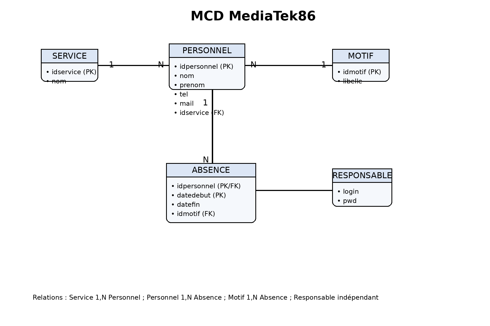
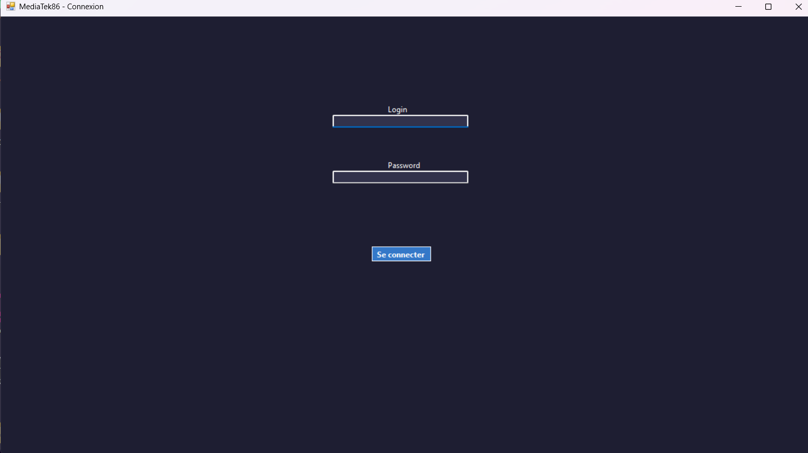
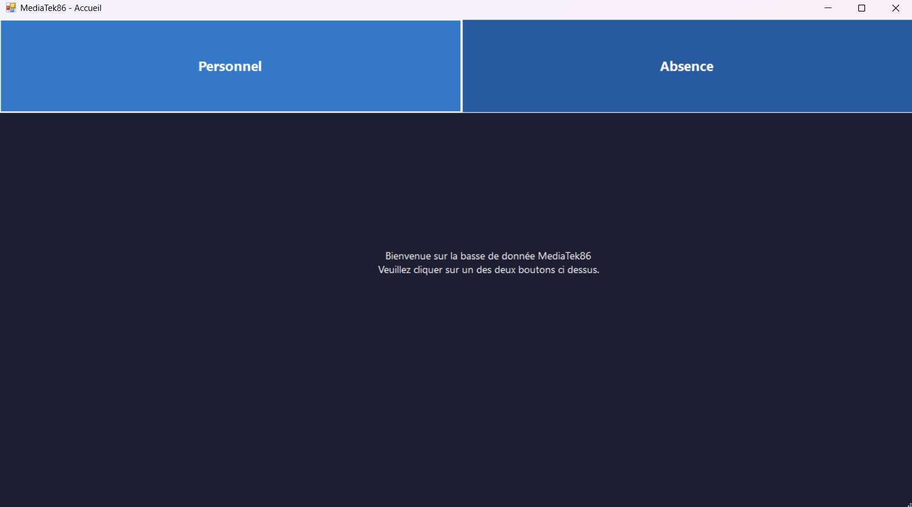
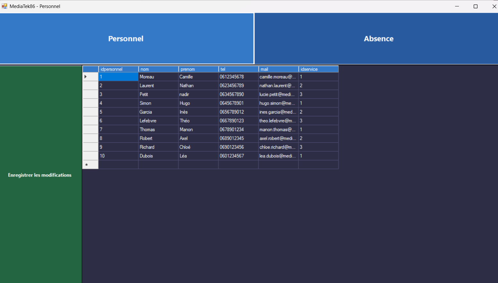
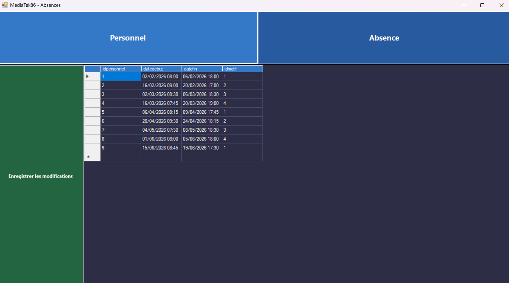
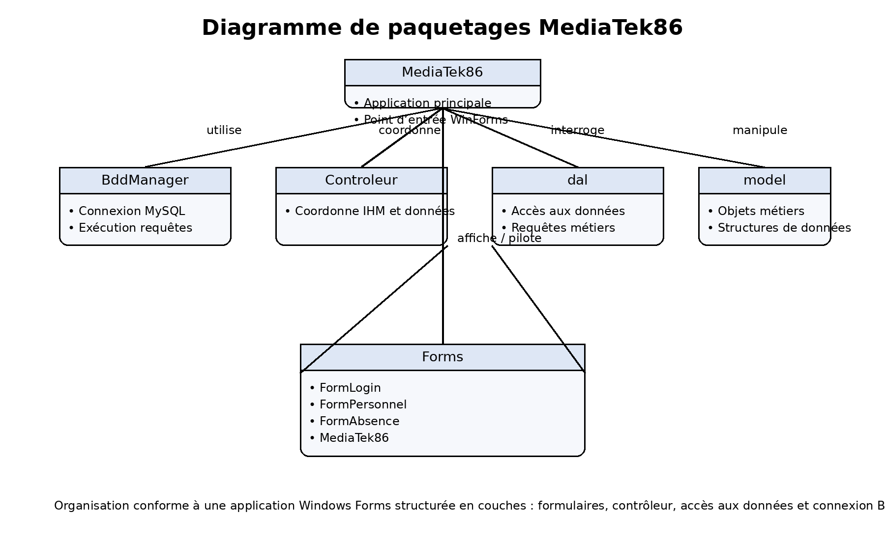

# MediaTek86

## Présentation

MediaTek86 est une application bureau développée en C# avec Windows Forms.  
Elle permet de gérer la base de données d'une médiathèque : suivi du personnel, gestion des absences et authentification des responsables, le tout connecté à une base de données MySQL.

L'application répond aux cas d'utilisation demandés dans le cadre de l'atelier professionnel :
- connexion sécurisée à l'application via un compte responsable ;
- ajout, modification et suppression de membres du personnel ;
- affichage, ajout, modification et suppression d'absences ;
- contrôle automatique du chevauchement des absences ;
- création d'un installeur Windows fonctionnel.

---

## Contexte

Ce projet a été réalisé dans le cadre du **devoir 2 de l'atelier de professionnalisation**.  
L'objectif était de produire une application Windows Forms en C# / .NET Framework, construite selon le même modèle que l'application Habilitations, avec une base de données MySQL et une organisation structurée en couches.

Le projet repose sur une architecture comportant :
- un dossier `BddManager` pour la gestion de la connexion à la base de données ;
- un dossier `dal` pour la couche d'accès aux données ;
- un dossier `Controleur` pour la logique de contrôle ;
- un dossier `model` pour les classes métier ;
- plusieurs formulaires Windows Forms pour l'interface utilisateur.

---

## Technologies utilisées

| Technologie | Rôle |
|---|---|
| C# / .NET Framework 4.8 | Langage et environnement de développement |
| Windows Forms | Interface graphique bureau |
| Visual Studio 2022 | IDE de développement |
| MySQL | Base de données relationnelle |
| MySql.Data (NuGet) | Connecteur MySQL pour C# |
| WampServer / phpMyAdmin | Serveur local et administration de la base |
| Looping | Conception du modèle conceptuel de données |
| GitHub | Versionnement et sauvegarde du projet |
| Visual Studio Installer Projects | Création de l'installeur Windows |

---

## Base de données

La base de données `mediatek86` contient les tables suivantes :

| Table | Rôle |
|---|---|
| `personnel` | Contient les informations des membres du personnel (nom, prénom, téléphone, mail, service) |
| `service` | Contient les services auxquels appartient le personnel |
| `absence` | Contient les périodes d'absence du personnel (dates de début et de fin, motif) |
| `motif` | Contient les motifs d'absence (vacances, maladie, motif familial, congé parental) |
| `responsable` | Contient les identifiants de connexion à l'application |

---

## MCD

Le modèle conceptuel de données de MediaTek86 repose sur cinq entités : `service`, `personnel`, `absence`, `motif` et `responsable`. Un service peut regrouper plusieurs membres du personnel, un membre du personnel peut posséder plusieurs absences, et chaque absence est associée à un seul motif. L'entité `responsable` est utilisée pour l'authentification à l'application.

---

## Interfaces

### Connexion

L'application démarre sur un formulaire de connexion. Le responsable saisit son identifiant et son mot de passe pour accéder à l'application. En cas d'identifiants incorrects, un message d'erreur s'affiche.

---

### Accueil

Une fois connecté, le responsable accède au menu principal. Deux boutons permettent de naviguer vers le formulaire de gestion du personnel ou celui des absences.

---

### Gestion du personnel

Le formulaire Personnel affiche la liste complète des membres du personnel dans un tableau. Il est possible d'ajouter une ligne, de modifier une cellule ou de supprimer une ligne directement dans le tableau, puis d'enregistrer les modifications en base de données via le bouton dédié.

---

### Gestion des absences

Le formulaire Absences affiche toutes les absences enregistrées. L'ajout, la modification et la suppression s'effectuent directement dans le tableau. Avant tout enregistrement, un contrôle de chevauchement vérifie qu'un même employé n'a pas deux absences dont les périodes se superposent.

---

## Diagramme de paquetages

Le projet MediaTek86 est organisé sous la forme d'une application Windows Forms structurée en plusieurs couches. Le dossier `BddManager` gère la connexion à la base de données, le dossier `dal` centralise l'accès aux données, le `Controleur` assure la liaison entre l'interface et la logique métier, tandis que les formulaires WinForms constituent l'interface utilisateur de l'application.

---

## Fonctionnalités

L'application permet de :

**Authentification**
- se connecter à l'aide d'un identifiant et d'un mot de passe responsable ;

**Gestion du personnel**
- afficher la liste du personnel dans un DataGridView ;
- ajouter un nouveau membre du personnel ;
- modifier les informations d'un membre ;
- supprimer un membre du personnel ;
- enregistrer les modifications en base de données ;

**Gestion des absences**
- afficher la liste des absences ;
- ajouter une nouvelle absence ;
- modifier une absence existante ;
- supprimer une absence ;
- empêcher l'ajout ou la modification d'une absence en cas de chevauchement pour le même employé ;
- enregistrer les modifications en base de données.

---

## Étapes de construction

### Étape 1 — Installation des outils
- installation de Visual Studio 2022 ;
- installation de WampServer et phpMyAdmin ;
- installation de Looping pour la modélisation ;
- installation des packages NuGet nécessaires (MySql.Data, etc.).

### Étape 2 — Création de la base de données
- conception du modèle conceptuel de données sous Looping ;
- export du schéma au format SQL ;
- import du script `mediatek86.sql` dans phpMyAdmin ;
- insertion des données de base (personnel, absences, responsable).

### Étape 3 — Design de l'application
- conception des maquettes des formulaires ;
- personnalisation de l'interface Windows Forms (couleurs, polices, boutons) ;
- harmonisation visuelle sur l'ensemble des formulaires.

### Étape 4 — Programmation
- mise en place de la connexion à la base via `BddManager` ;
- développement des formulaires `FormLogin`, `MediaTek86`, `FormPersonnel`, `FormAbsence` ;
- implémentation du CRUD complet pour le personnel ;
- implémentation du CRUD complet pour les absences ;
- ajout du contrôle de chevauchement des absences.

### Étape 5 — Versionnement et sauvegarde
- initialisation du dépôt GitHub ;
- sauvegardes régulières du projet ;
- rédaction de la documentation.

### Étape 6 — Installeur
- création du projet d'installation via Visual Studio Installer Projects ;
- ajout de la sortie principale (MediaTek86.exe) et des dépendances ;
- génération et test du fichier `.msi`.

---

## Installation

### Prérequis
- Windows 10 ou supérieur ;
- Visual Studio 2022 ;
- WampServer avec MySQL actif ;
- package NuGet `MySql.Data`.

### Procédure
1. Cloner ou télécharger le projet depuis GitHub.
2. Lancer WampServer et s'assurer que MySQL est actif.
3. Importer le fichier `mediatek86.sql` dans phpMyAdmin.
4. Vérifier les paramètres de connexion dans `MediaTek86/App.config` (serveur, base, utilisateur, mot de passe).
5. Ouvrir la solution `MediaTek86.sln` dans Visual Studio.
6. Restaurer les packages NuGet si nécessaire (clic droit sur la solution > Restaurer les packages).
7. Compiler le projet en mode Release.
8. Lancer l'application avec F5 ou utiliser le fichier `.msi` généré par l'installeur.
9. Se log en utilisant "jules" et "nipsei" en pswd

---

## Démonstration vidéo

> Lien vers la vidéo de démonstration

[Voir la vidéo de démonstration](LIEN_VIDEO_ICI)

---

## Auteur

**Jules** — Projet réalisé dans le cadre de l'atelier de professionnalisation.
